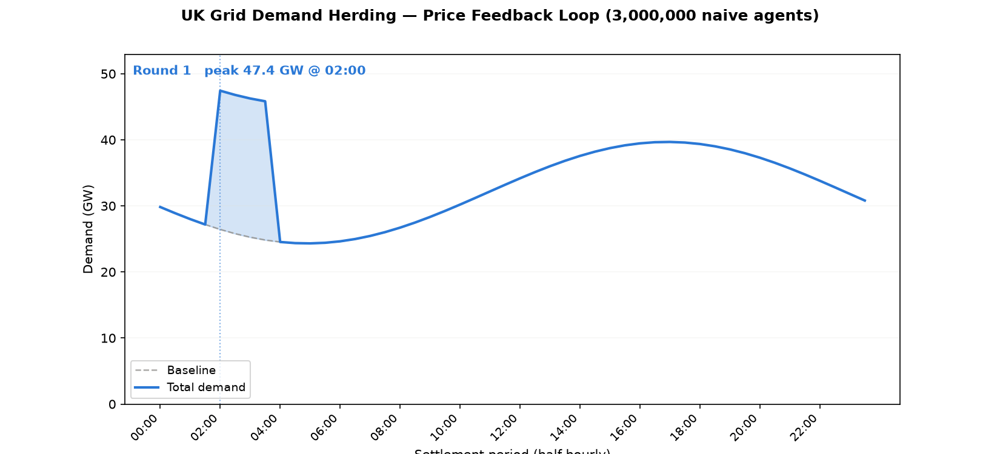
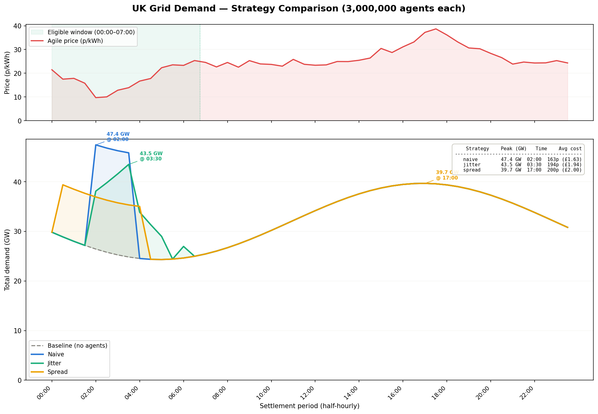

# gridherd — agent-based simulation of demand herding on the UK electricity grid

Demand herding happens when price-responsive devices — EV chargers, heat pumps, batteries — all see the same cheap-price signal and respond identically. Instead of smoothing demand, thousands of independent, "rational" decisions synchronise into a single spike. This project simulates a fleet of up to 3 million EV chargers reacting to a UK Agile-style tariff to show how herding forms, why partial fixes (randomised delay, mixed strategies) don't solve it, and why price feedback alone can make it worse.





## Key findings

- **The spike relocates, it doesn't just grow.** 3M naive agents chasing the cheapest overnight price move the grid's peak from 39.7 GW at 17:00 (the evening peak the grid is built for) to 47.4 GW at 02:00 (+19.6%) — an hour with no spare capacity and no fast-response reserve.
- **Spreading demand across a wider cheap window eliminates the spike entirely.** Distributing charging uniformly across 8 overnight periods instead of piling into the cheapest 4 brings the new peak back down to 39.7 GW — identical to baseline — for a 37p (23%) premium per charge.
- **Partial adoption barely helps.** A 50/50 mix of naive and randomised-delay ("jitter") agents still peaks at 44.7 GW. Halving the naive population doesn't halve the spike, because the remaining naive agents still herd perfectly among themselves.
- **Price feedback makes the spike migrate, not dissolve.** Feeding realised demand back into the price signal doesn't spread the fleet out — it just makes today's cheap period expensive tomorrow. The result is a 2-cycle oscillation between 02:00 and 01:00 that never converges, and round 2 (49.0 GW) is worse than round 1.

## Quick start

```bash
pip install -e .
gridherd run --agents 3000000 --plot
```

## CLI reference

```
gridherd run --agents 3000000 --strategy naive|jitter|spread|all --plot
gridherd run --agents 3000000 --mix naive=0.5,jitter=0.5 --plot
gridherd run --agents 3000000 --feedback --rounds 10 --plot
```

- `--strategy` — charging strategy for a single-population run; `all` compares naive, jitter, and spread and generates a comparison plot.
- `--mix` — run a mixed population, e.g. `naive=0.5,jitter=0.5` (fractions normalise automatically).
- `--feedback` — enable the iterative price-feedback loop instead of a single-shot run.
- `--rounds` — number of feedback rounds to simulate (only with `--feedback`).

## Background

The UK's [Electric Vehicles (Smart Charge Points) Regulations 2021](https://www.legislation.gov.uk/uksi/2021/1467/regulation/11/made), Regulation 11, requires domestic smart chargers to apply a randomised delay of up to 10 minutes before starting a scheduled charge, specifically to prevent synchronised demand spikes as EV adoption scales. This project tests that assumption directly: with settlement periods of 30 minutes, a 10-minute jitter shifts most agents by less than one period — far too small relative to the scale of the herding effect it's meant to prevent. The strategies that do work (wider spread windows) come with a real cost the regulation doesn't account for.